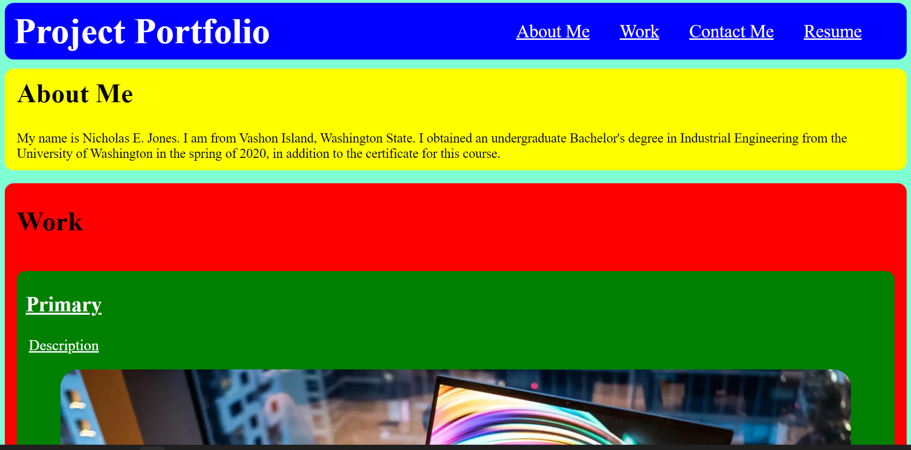

# professional_portfolio
The site created by this repository creates a portfolio page, showcasing placeholders for assignments completed for this certification course.

-Description-

    The repository files now generate a crude portfolio website.
    When in use, the site has a header section with links to the
    'About Me', 'Work', and 'Contact Me' sections.
    Following this, the 'About Me' section has a brief summary bit about myself.
    Lower down, the 'Work' section contains a large primary display block, as a placeholder
    for a potential project link. Below it, there are four more smaller blocks distributed
    equally and evenly across the page.
    All blocks have a slight orange glow when hovering the mouse cursor over them, and currently
    hold empty links which could be filled with potential projects.
    Finally, at the bottom of the page is a 'Contact Me' section with my phone number and a
    link to my GitHub account.

-Known Flaws-
    -The site colors were intended as placeholders to aid in visualizing the 
    content when building up the site.
    -The CSS file does not currently have any code for different screens. (@ media screen)
    -The 'glowing' effect when hovering the mouse over the block elements needs to be refined.
    -The titles and descriptions of block elements need to overlay their images. They currently do not.
    -There are no variables to hold, for example, colors for a potential cohesive color scheme to use
    across the webpage.

-Code Description-
    Currently, the CSS file is roughly organized by addressing classes in the order they are shown on the
    website, with elements addressing the header closer to the top, and elements addressing the 'Contact Me'
    section closer to the bottom. The comments provided roughly break down the different sections of code
    addressing larger overall grouped elements, such as all of the 'Work' blocks, all of the page header elements,
    etc.
    
-LINK- https://njscc.github.io/professional_portfolio/ 

-SCREENSHOT-

